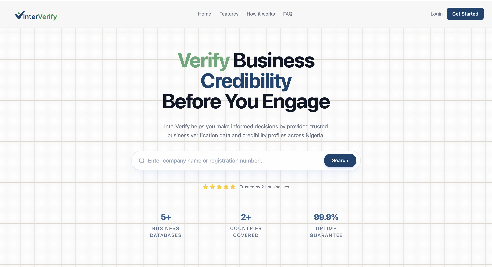

# InterVerify ([Enyata Hackaton 2026](https://buildathon.enyata.com/))

[Live Demo Link](https://brid-enyata-hackathon-project.vercel.app): 

## Overview
InterVerify is a business verification platform designed to foster trust within the digital economy. In an era where "ghost businesses" and digital fraud are on the rise, InterVerify provides a double-sided solution:

- For Businesses: A seamless onboarding experience where companies can verify their legal status, physical existence, and financial compliance to earn a "Verified" badge of trust.

- For Consumers: A transparent look-up directory where anyone can verify the legitimacy of a business before engaging in a transaction, significantly reducing the risk of fraud.

- By leveraging Interswitch’s robust API infrastructure, InterVerify ensures that every verified entity is backed by real-world financial data and legal records, bridging the gap between digital identity and physical accountability.

## Key Features
- Verified Business Directory: A searchable database of vetted businesses with real-time status updates.

- KYB (Know Your Business) Automation: Streamlined verification flows for business owners to upload and validate credentials.

- Interswitch Integration: Utilizing payment and identity rails to ensure the business is financially active and legitimate.

- Trust Badge API: A snippet for verified businesses to display on their own websites, linking back to their InterVerify profile.

## How to Test
- Visit the [Homepage](https://brid-enyata-hackathon-project.vercel.app) 
- Search for Business through the Search Functionality in the [Homepage](https://brid-enyata-hackathon-project.vercel.app/) Hero section
  Note: The list of business returned are mostly fake data that is being used to seed the application to simulate a better user experience for the purpose of demoing the application in the hackaton
  - Each returned business has a name, address, verification score along side other useful business information
  - Clicking on see more would carry you to a detail page of the business listing for your keyword

- Sign Up for an account on the Platform
- Login Into your account
- Upload Business Verification Data on the Platform
  - Use this Details to get verification since we are using Test Mode of Interswitch API
    - Business Name: Neem
    - Business Email: <random_business_email>
    - Business Phone: 
    - Business Address: 13 adetobi kofoworola street ajayi
    - Website: <random_business_website.com>
    - Business Description: <random_business_description sentence>
    - CAC Registration Number: Neem
    - Tax Identification Number (TIN): 08120451-1001
    
    Once you are done, Submit this details to trigger Business Verification
    Go back to dashboard to view your Verification status and score based on the validity of the submitted data

- You can update your Account details in the Setting Page on the dashboard

## Interswitch API Usage
- [CAC API](https://developer.interswitchgroup.com/marketplace/api/detail?id=68ad1daa971fcd6d60a87791): The CAC Lookup API leverages the Corporate Affairs Commission (CAC) database to enable authorized users to retrieve detailed information about a business or company registered with CAC including the company directors, shareholders and secretary. It provides a secure and efficient solution for accessing corporate registration data.

- [TIN API](https://developer.interswitchgroup.com/marketplace/api/detail?id=67bd488f5da0515b2a390d06): The TIN Verification API enables businesses to validate the Tax Identification Number (TIN) of individuals and corporate entities. It checks the authenticity of a provided TIN and returns associated business or taxpayer details from the tax authority database.

- [Physical Address API](https://developer.interswitchgroup.com/marketplace/api/detail?id=682475189450991869456e41): The Address Verification API helps businesses validate and verify customer-provided addresses by checking them against authoritative address databases. It confirms the accuracy and existence of a given address.

- [BVN Full Details API](https://developer.interswitchgroup.com/marketplace/api/detail?id=682476229450991869456e42): The BVN Full Details API enables businesses to verify the existence and validity of a Bank Verification Number (BVN) in real-time. It returns the full information of the BVN holder. This API helps organizations enhance KYC compliance, reduce fraud, and streamline customer onboarding.

## Problem Solved
- ✅ Business Validity Look ups for Users/Customers
- ✅ Business Verification Status Look for Users/Customers
- ✅ Business Verification for Business
 

## Business Angle
InterVerify addresses the multi-billion dollar challenge of digital trust by transforming business verification from a static compliance hurdle into a dynamic market advantage. In the current landscape, small and medium enterprises (SMEs) often struggle to prove their legitimacy to wary online consumers, while customers face increasing risks of financial loss to "ghost businesses." By aggregating Interswitch’s real-time financial and legal data, InterVerify creates a high-integrity verification ecosystem. For businesses, the "Verified" badge serves as a powerful conversion tool that reduces customer friction and accelerates growth. For the wider economy, the platform serves as a critical layer of infrastructure that mitigates fraud, lowers the cost of due diligence, and fosters a transparent digital marketplace where merit; not anonymity—determines success.

## Tech Stack
| Component | Technology |
| :--- | :--- |
| Frontend  | React, Tailwindcss, JavaScript |
| Backend   | FastAPI ([API Docs](https://brid-enyata-hackathon-project.onrender.com/docs)) |
| Payment/Identity | Interswitch API |
| Design | Figma |

## The Team
Developed with ❤️ by The Real Awesome People:

- [Idongesit Inyang](https://github.com/id-inyang) - Frontend Developer (Frontend Lead)
- [Brian Obot](https://github.com/brianobot) - Backend Developer (Backend Lead)
- [Angel Emele](https://github.com/Angelle-ace) - Product Manager / UI Designer (Design Lead)
